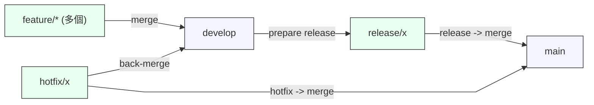
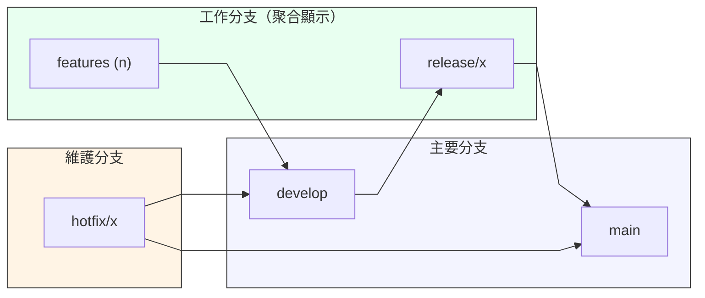

# 檔案流程圖

以下為應用程式啟動與輸出流程的簡單 Mermaid 圖，說明 `Program.cs` 的執行路徑與輸出。

````````


# GitFlow 更簡化視圖

目前圖仍覺得雜亂，已用兩張更精簡的 Mermaid 圖來降低細節、群組分支，讓整體結構更好理解：

1) 高階總覽（把所有 feature 聚合為一個節點，僅顯示主要合併方向）



2) 分群視圖（使用 `subgraph` 把主要類型分區，便於在複雜 repo 中閱讀關係）



說明與建議：
- 若圖仍亂，請把要顯示的分支再裁減（例如只顯示最近三個 release / 主要 feature），或分成多張圖（例如：一張只看 release，一張只看 feature）。
- 若你要我把目前 repo 的實際分支（`git branch -a`）自動產成 Mermaid，我也可以幫你寫個小腳本來過濾與輸出。
